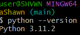
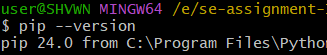

Developer Environment Setup Documentation
This document outlines the step-by-step process for setting up a developer environment with Windows 11, Visual Studio Code, Git, Python, and MySQL. Follow each step carefully to ensure a smooth setup.

1. Choosing Your Operating System (OS)
     After having installed the most suitable operating system(Download and Install Windows 10/11 by visiting the Windows 10/11 Download Page.)
    
2. Install a Text Editor or Integrated Development Environment (IDE)
   Download and Install Visual Studio Code
     (Visit the Visual Studio Code Download Page and select the appropriate version for Windows and download the installer Run the installer and follow the on-screen instructions to complete the installation.
3. Set Up Version Control System
     Install Git by visiting the Git download page and download the appropriate version for Windows.
     Run the installer and follow the on-screen instructions to install.
        NB:select the options to integrate Git with the command line and Windows Explorer context menu.
    
     Configure Git by openning Git Bash as an administrator(access permissions) which was installed with Git
     Configure your username and email
     Confirm the configuration
     
    
     Visit GitHub to Sign in/Sign up for an account and initialize a Git repository.
      create a new folder for your project and open it in Visual Studio Code.
      Open a terminal in Visual Studio Code (Ctrl + ).
       git init
       Create a README file
     make the first commit:
        Add and commit the README file:
          git add README.md
          git commit -m "Initial commit"
4. Install Necessary Programming Languages and Runtimes
     Install Python.Visit the Python Download Page and Download the latest version for Windows.
     Run the installer and make sure to check the box "Add Python to PATH" while following the on-screen instructions to complete the installation.
     Verify Python Installation.Open a terminal in Visual Studio Code:
     

5. Install Package Managers
     Install pip (Python).Pip is installed by default with Python. 
     Verify the installation:
     

6. Configure a Database (MySQL)
     Download and Install MySQL.(Visit the MySQL Installer page and download the MySQL Installer for Windows.)
     Run the installer and follow the on-screen instructions to install MySQL.
     During installation, configure the root password and note it down for future use.
     Verify MySQL Installation
     Open MySQL Workbench (installed with MySQL)/Can be installed seperately.
     Connect to the local MySQL server using the root account and password.

7. Set Up Development Environments and Virtualization (Optional)
     Install Docker(.Visit the Docker Desktop Download page and download the Docker Desktop for Windows.)
     Run the installer and follow the on-screen instructions.
     After installation, open Docker Desktop to verify that it is running.

8. Explore Extensions and Plugins
     Visual Studio Code Extensions
      Open Visual Studio Code.
      Go to the Extensions view by clicking the Extensions icon in the Activity Bar on the side of the window.(Ctrl + Shift + X)
      install the following recommended extensions:Python, GitLens, MySQL, Docker, Prettier - Code formatter
